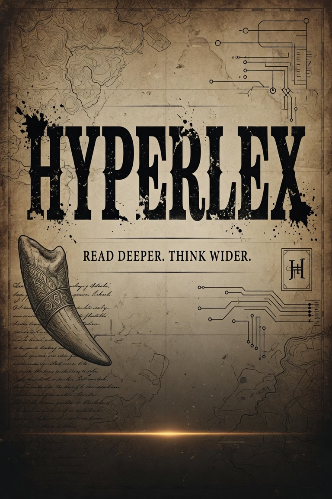

---
hide:
  - navigation
  - toc
---

# <!-- intentional empty H1: splash uses brand block -->

<figure class="hlx-splash-hero" markdown>

</figure>

HYPERLEX

READ DEEPER. THINK WIDER.

Memetic emergence engine · Hermes skill · v0.4.0

pipeline = auto · atoms not bags · settled Brier only · vector ≠ probability

**Researchers**

Interpret lineage, vector neighbors, Phase 5, and Brier without overclaiming.

[Reading evidence →](demos/reading-evidence.md){ .md-button .md-button--primary }

[Slang map](map/index.md){ .md-button }
[Run history](archive/index.md){ .md-button }

**Operators**

Install, run the auto pipeline, settle forecasts, seed / promote vectors.

[Telemetry desk →](telemetry.md){ .md-button .md-button--primary }

[How to run](operator-loop.md){ .md-button }

Visual · <a href="https://grok.com/imagine/post/0fef2df1-6bec-4b18-9ee6-823dd77ba9f6">Grok Imagine</a>
· <a href="https://github.com/scrimshawlife-ctrl/Hyperlex">GitHub</a>

