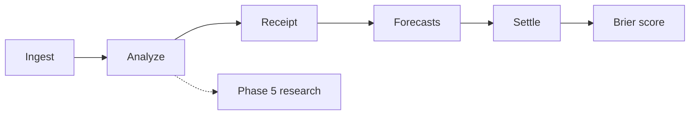

---
hide:
  - toc
---

# Hyperlex

<div class="hlx-status" markdown>
<span><span class="hlx-dot"></span><strong>v0.4.0</strong></span>
<span>Hermes skill · Python package</span>
<span>Settled Brier only</span>
<span>Local-first · offline mock ready</span>
</div>

<p class="hlx-lead hlx-purpose">
<strong>Hyperlex detects emerging slang and cultural signals, traces their lineage,
scores virality and hyperstition potential, and emits integrity-hashed receipts.</strong>
Brier calibration is computed <em>only</em> after outcomes are settled — never invented on open analysis.
</p>

## What happens on a run



Phase 5 is optional and always **SPECULATIVE** with `brier: null` — see [glossary](start/glossary.md#phase-5).

| Stage | What you get |
|-------|----------------|
| **Ingest → analyze** | Lineage family, atomic terms, virality signals |
| **Receipt** | Integrity-hashed JSON (auditable) |
| **Forecasts** | Open probabilities waiting for settlement |
| **Settle → score** | Real Brier only after operator outcome |
| **Phase 5** | Speculative sims — never Brier |

## Start here — three actions

<div class="hlx-cta-grid" markdown>

<div class="hlx-cta-card hlx-cta-card--primary" markdown>

### 1. Try offline

Zero config. No API keys. Produces a real receipt; `brier` stays `null`.

```bash
python3 scripts/hyperlex.py demo
```

[Try offline →](start/quickstart.md){ .md-button .md-button--primary }

</div>

<div class="hlx-cta-card" markdown>

### 2. Operator loop

Daily path: pipeline → pending → settle → score-series.

[Operator loop →](operator-loop.md){ .md-button .md-button--primary }

</div>

<div class="hlx-cta-card" markdown>

### 3. See real runs

Golden receipts, archive snapshots, featured example.

[See it work →](start/see-it-work.md){ .md-button .md-button--primary }

</div>

</div>

## Featured example (30 seconds)

**Golden receipt · brainrot-aura** · query `brainrot aura farming mid cooked`

| Field | Value |
|-------|--------|
| Lineage family | `brainrot-aura` |
| Matched atoms | brainrot · aura · mid · cooked · … |
| Confidence | 0.98 (INFERRED) |
| Integrity | `e8e43b010371` |
| **Brier** | **`null`** (correct — not settled) |

[Human summary + JSON →](start/see-it-work.md#featured-brainrot-aura) ·
[Open map on this family →](map/index.md?family=brainrot-aura) ·
[Archive catalog →](archive/index.md)

## Explore the rest

<div class="hlx-gateway" markdown>

| Need | Go |
|------|-----|
| **Commands** | [Command map](commands.md) |
| **Architecture** | [Architecture](architecture.md) |
| **Case studies** | [Case studies](case-studies.md) |
| **Slang lineages** | [Lineages](slang-lineages.md) · [Map](map/index.md) |
| **Status / telemetry** | [Status](status.md) · [Telemetry desk](telemetry.md) |
| **Glossary** | [Terms & hard constraints](start/glossary.md) |
| **Why settled Brier** | [Settled Brier only](start/settled-brier.md) |

</div>

## Hard rules (one line each)

- **No fabricated Brier** — open analysis always has `brier: null`.
- **Phase 5 is SPECULATIVE** — research tooling, not measurement.
- **No Abraxas hard import** — hosts may import Hyperlex; not the reverse.
- **Local-first** — durable state in `~/.hyperlex/`; Pages is static history.

Full glossary: [start/glossary.md](start/glossary.md)

---

<p class="hlx-splash-brand-foot">READ DEEPER. THINK WIDER.</p>

<p class="hlx-posture">
v0.4.0 · Hermes skill · settled Brier only · offline mock default for first success
</p>
